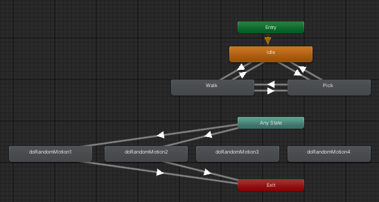

# MY-Little-Jarvis-3D

- 개요
  - 본 프로젝트인 MY-Little-Jarvis는 Stand-Alone인 동시에 Server로 활용할 수 있음
  - 멀티 플랫폼으로서의 예시를 보여주기 위해, Unity를 이용한 3D 인터페이스를 구축
- 프로젝트 환경
  - Unity 2022.3.44f1
  - C#

## 주요 서비스 화면 예시

<차후 추가>

## Component

### UI

- Canvas
  - Render Mode : Screen Space - Camera
  - Render Camera : Main Camera
  - Image_input
    - 하위로 input Field(TMP)로 input을 받음
    - Character 좌클릭시 등장
    - 입력창 내에서 Enter로 입력받기, ESC로 취소
- Character
  - MeshCollider로 이벤트 감지
  - Script : Draggable Image
  - Animator
    - Entry, Idle, Walk, Pick을 boolean으로 Exit Time없이 transition
    - Any State, Motion, Exit을 Trigger로 transition
        

### Camera

- 캐릭터와 UI를 제외한 것이 보이지 않게 설정
  - Clear Flags를 Solid Color로 설정
  - Background 색상을 투명(RGBA = (0, 0, 0, 0))으로 설정
  - Culling Mask에서 투명하지 않은 오브젝트 레이어(UI, Char) 설정
