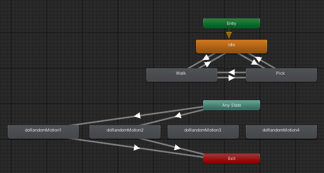

# Unity_Scripts

- 개요
  - 유니티에서 사용하는 스크립트 및 특징 정리

## Component

### UI

- Canvas
  - Render Mode : Screen Space - Camera
  - Render Camera : Main Camera
  - Image_input
    - 하위로 input Field(TMP)로 input을 받음
    - Character 좌클릭시 등장
    - 입력창 내에서 Enter로 입력받기, ESC로 취소
  - Image_AnswerBalloon : 답변용 말풍선
    - Anchor pivot 하단
    - AnswerBalloonManager로 크기 조절
- Character
  - collider : MeshCollider로 이벤트 감지
    - CharHandler, DragHandler과 연계
  - Scripts
    - FallingObject : 자유낙하 관리
    - CharAttributes : 고유속성관리. API 호출등에 활용
  - bone : root_bone부터 각각 리깅된 모델
  - Animator
    - Entry, Idle, Walk, Pick을 boolean으로 Exit Time없이 transition
    - Any State, Motion, Exit을 Trigger로 transition
        

### Camera

- 캐릭터와 UI를 제외한 것이 보이지 않게 설정
  - Clear Flags를 Solid Color로 설정
  - Background 색상을 투명(RGBA = (0, 0, 0, 0))으로 설정
  - Culling Mask에서 투명하지 않은 오브젝트 레이어(UI, Char) 설정
- Field of View를 10으로 설정하여, 3D Object인 Char이 정면을 보게 계속 설정

### Text

- TextMeshPro
- Font : 상업화이용까지 가능한 폰트
  - 일본어, 영어 : NotoSansJP - kgsi/japanese_full.txt
  - 한국어 : Fallback으로 SUIT

## Script

### Manager

- 개요 : 여러 객체나 시스템을 관리하고 조정. 싱글톤
  - GameManager : 전체 상태를 관리하고 시스템간 상호작용
    - StatusManager : 현재 Char에 대한 Status를 관리
      - Status : isFalling, isPicking, isWalking, isListening, isAnswering, isThinking, isChatting, isChatting
    - TransparentWindow : 배경을 투명하게 만듬
  - AudioManager : 게임의 오디오 요소를 관리
  - UIManager : UI요소 관리 및 화면 전환/업데이트
    - AnswerBalloonManager : 말풍선을 관리하는 Manager
  - VoiceManager : 음성/답변관리
    - Voicemanager : Audio Source에 적절한 clip을 재생/중지
    - DialogueManager : json으로 대사를 저장/로딩하여 관리
  - APIManager : MY-Little-Jarvis 서버를 호출하고 반환값을 관리

## Handler

- 개요 : 특정/단일 이벤트나 작업을 처리하는 단위
  - ChatHandler : 채팅시 일어나는 이벤트 관련
  - DragHandler : 드래그시 일어나는 이벤트 관련
  - ClickHandler : 클릭시 일어나는 이벤트 관련

## Assets

- Char : 캐릭터 Prefab
- Fonts : 라이센스 - Open Font License
  - Noto Sans JP : 메인 폰트. 일본어, 영어
  - SUIT : Fall back 폰트. 한국어
- Sprites : png 등 관리
  - 외부 png Texture Type : Sprite(2D & UI)
- StreamingAssets : 패키징 되지 않는 파일 관리.
  - Voices : 목소리 관리
- persistentDataPath : write에 대한 권리가 있는 장소.
  - API 등으로 전송받은 파일 저장, setting등의 로컬 파일 저장.

## Troube Shooting

### Windows API 사용

- Plugins에 C:\Windows\Microsoft.NET\Framework64\v4.0.30319에서 가져온 dll 이동
  - System.Drawing.dll : ScreenShotManager에서 사용
  - System.Windows.Forms.dll : TrayIconManager에서 사용
- Project Settings>Other Settings>API compatibility Level을 .Net Standard 2.1에서 Framework로 변경

### Android Studio 연동

- AAR 프로젝트
- Dependency 이슈 : AndroidX
  - unity-jar-resolver를 이용해 Dependency.xml 구축
